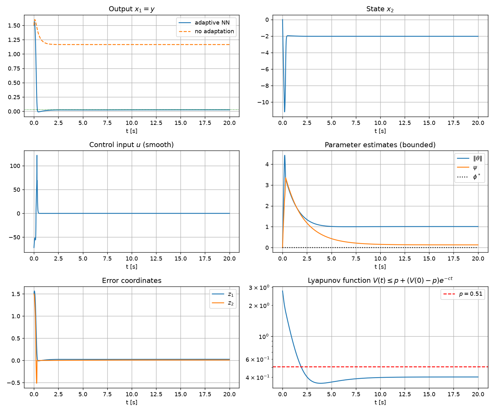
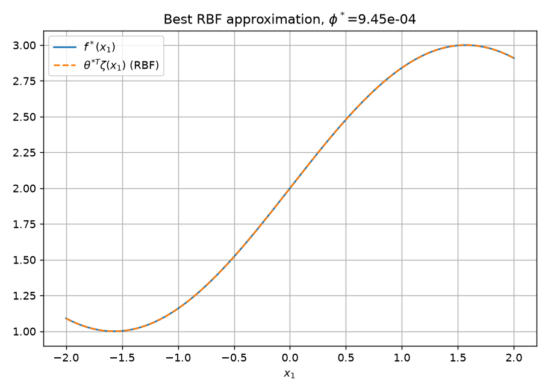

# Polycarpou 自适应神经网络控制 —— 通俗解读与仿真复现

本项目用 **PyTorch** 复现并仿真验证了下面这篇经典论文的控制方案：

> Marios M. Polycarpou, *"Stable Adaptive Neural Control Scheme for Nonlinear Systems,"*
> IEEE Transactions on Automatic Control, vol. 41, no. 3, pp. 447–451, March 1996.

---

## 一、这个方案到底在干什么？（大白话）

想象你在开一艘船，舵（控制输入 `u`）只能直接控制**船头转向的角速度**（状态 `x2`），
但真正想控制的是**航向角**（状态 `x1`，也就是输出 `y`）。麻烦在于：

- 有一个你**看不懂、也不知道规律**的力 `f*(x1)` 在不停地推动航向角；
- 这个未知的力**不作用在舵上**，而是作用在“上一层”的航向上（这叫**非匹配不确定性**）；
- 你甚至**不知道这个未知力的误差上界是多少**。

论文的思路是：

1. **层层递推（反步法 backstepping）**：先设计一个“虚拟舵” `α` 把航向拉回 0，再用真正的舵 `u` 去追踪这个虚拟舵。
2. **神经网络当“翻译官”**：用一个 RBF（径向基）神经网络去**在线学习**那个看不懂的力 `f*(x1)=θ*ᵀζ(x1)+δ`，其中 `θ*` 是理想权重，`δ` 是网络逼近误差。
3. **两样东西一起在线估计**：
   - `θ` —— 网络的权重（学那个未知力的形状）；
   - `ψ` —— **逼近误差的上界**（学“我还差多少没学到”），这样**不需要事先知道误差上界**。这也是本文最大的贡献之一。
4. **用 Lyapunov 方法保证稳定**：所有自适应律都由一个“能量函数” `V` 推导出来，保证系统能量不增，从而**所有信号有界、输出收敛到原点附近的小邻域**。

一句话：**用反馈先把大扰动压下去，再用神经网络在线学掉剩下的未知部分，全程用数学证明不会发散。**

---

## 二、被控对象

论文研究的二阶（非匹配）系统：

$$
\dot{x}_1 = x_2 + f^*(x_1), \qquad \dot{x}_2 = u, \qquad y = x_1
$$

其中 `f*` 是未知光滑函数。把标称已知部分记作 `f`，未知部分记作 `φ`：

$$
f^*(x_1) = f(x_1) + \varphi(x_1), \qquad \varphi(x_1) = \theta^{*T}\zeta(x_1) + \delta(x_1)
$$

- `ζ(x1)`：已知的 RBF 基函数向量（固定中心、固定宽度）；
- `θ*`：未知的理想权重；
- `δ(x1)`：**网络重构误差**，满足 Assumption 1：在紧集 `R` 上 `|δ(x1)| ≤ φ*`（`φ*` 未知）。

---

## 三、控制律与自适应律

**坐标变换（反步法）**

$$
z_1 = x_1,\qquad z_2 = x_2 - \alpha(x_1,\theta,\psi)
$$

$$
\alpha = -x_1 - f(x_1) - \theta^{T}\zeta(x_1) - \beta_1,\qquad \beta_1 = \psi\,w_1,\ \ w_1=\tanh\!\left(\frac{x_1}{\varepsilon}\right)
$$

**控制律**（平滑函数，无切换、无抖振）

$$
u = -z_1 - z_2 + \frac{\partial \alpha}{\partial x_1}\big(x_2 + f + \theta^{T}\zeta\big) + \frac{\partial \alpha}{\partial \theta}\,\dot{\theta} + \frac{\partial \alpha}{\partial \psi}\,\dot{\psi} - \beta_2
$$

其中 $\beta_2 = \psi\,w_2$，$w_2 = \frac{\partial \alpha}{\partial x_1}\,\tanh\!\big(\frac{\partial \alpha}{\partial x_1}\,z_2 / \varepsilon\big)$。

**权重自适应律**（含泄漏项 `σ`，防止权重漂移）

$$
\dot{\theta} = \Gamma\Big[\,z_1\,\zeta(x_1) - z_2\,\frac{\partial \alpha}{\partial x_1}\,\zeta(x_1) - \sigma\,(\theta-\theta^0)\,\Big]
$$

**误差上界自适应律**（本文的关键：在线估计重构误差上界）

$$
\dot{\psi} = \gamma\Big[\,z_1 w_1 + z_2 w_2 - \sigma\,(\psi-\psi^0)\,\Big]
$$

**Lyapunov 函数**

$$
V = \tfrac{1}{2}\Big(z_1^2 + z_2^2 + \tilde{\theta}^{T}\Gamma^{-1}\tilde{\theta} + \gamma^{-1}\tilde{\psi}^2\Big), \qquad \tilde{\theta}=\theta-\theta^{*},\quad \tilde{\psi}=\psi-\psi^{*}
$$

理论结果：`V` 满足

$$
V(t) \le p + \big(V(0)-p\big)e^{-ct}, \qquad p = \frac{X}{c}
$$

即 **半全局一致最终有界（SUUB）**：所有信号有界，输出 `y=x1` 收敛到原点附近一个半径为 `√(2p)` 以内的邻域。

---

## 四、仿真设置

| 项目 | 取值 |
|---|---|
| 未知函数 `f*(x1)` | `2 + sin(x1)`（论文未给数值算例，这里自行设定） |
| 标称已知 `f(x1)` | `0`（即完全没有先验知识） |
| 神经网络 | 9 个高斯 RBF + 1 个偏置，宽度 0.8，区域 `[-2, 2]` |
| 设计常数 | `ε=0.1, σ=0.1, Γ=5, γ=5, θ⁰=0, ψ⁰=0` |
| 初始状态 | `x1(0)=1.5, x2(0)=0, θ(0)=0, ψ(0)=0` |
| 积分 | SciPy `DOP853` 自适应步长（含 `tanh(z/ε)` 增益项，方程较“刚性”） |

> 注：RBF 的最佳逼近只产生 `φ* = 9.45e-4` 的重构误差，满足 Assumption 1。

---

## 五、仿真结果

**纵览：输出、状态、控制、参数估计、误差坐标、Lyapunov 函数**



**RBF 对未知函数的逼近效果**



关键结论：

| 指标 | 自适应神经网络 | 关闭自适应（同控制律、权重冻结） |
|---|---|---|
| 稳态 \|x₁\| | **2.65 × 10⁻²** | 1.17 |
| 峰值 \|u\| | 122（有界、光滑） | — |
| 参数估计 | `‖θ‖≈1.01, ψ≈0.13`，全部有界 | — |

- Lyapunov 函数从 `2.76` 单调下降到约 `0.40`，并始终不超过理论界 `p = 0.51`；
- 初始条件 `x1(0)=1, 1.5, 2` 均收敛到同一小邻域 → 验证了**半全局**性质；
- 关闭神经网络后输出残留很大误差 → 说明神经补偿是必要的。

---

## 六、如何复现

```bash
# 1. 用 miniforge 创建环境
mamba env create -f environment.yml
mamba activate nncontrol

# 2. 运行仿真
python polycarpou_anc.py
```

运行后会在 `results/` 下重新生成两张图，并在终端打印上述所有指标。

---

## 七、文件说明

```
polycarpou_anc.py     # 主程序：RBF 网络 + 控制律 + 自适应律 + 仿真
environment.yml       # 可复现的 conda 环境
results/
  polycarpou_anc_results.png   # 主结果图
  polycarpou_anc_approx.png    # RBF 逼近图
README.md             # 本文件
```

---

## 八、实现注意点（踩过的坑）

1. **反步法的“差分项”不能省**：控制律里必须包含 `(∂α/∂x₁)(x₂+f+θᵀζ)` 这一项，对应的权重自适应律要加上 `-z₂(∂α/∂x₁)ζ`，`w₂` 也必须带 `∂α/∂x₁` 因子。省略这些会明显变差甚至发散。
2. **RBF 中心别太密**：中心过密会让基函数强共线、`θ*` 病态变大，导致 Lyapunov 理论界 `p` 极其保守。9 个中心 + 偏置的组合数值条件较好。
3. **方程较刚**：由于 `tanh(z/ε)` 和 `1/ε` 项，固定步长 RK4 在 `dt=5e-4` 时会**数值发散**（并非系统真发散），因此改用自适应步长积分器。
4. **泄漏项 `σ` 的权衡**：`σ` 太小会让 `ψ` 漂移、系统失稳；`σ` 太大则稳态误差变大。`σ` 与 `Γ, γ, ε` 需要配合调。

---

## 九、局限与说明

- 论文关注的是**调节（regulation）到原点**，没有跟踪参考轨迹；
- 本文只仿真了二阶系统；论文指出可递归扩展到高阶纯反馈系统；
- 仿真是对论文**理论结论的定性/定量验证**，不代表对原论文所有定理细节的完全形式化证明。
